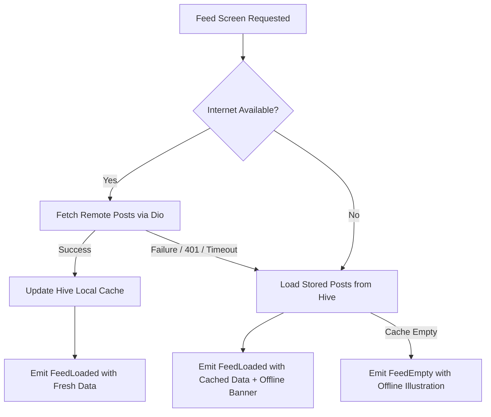

# 📱 Social Feed & Real-Time Agora Calling App

A high-performance Flutter mobile application engineered with **Clean Architecture**, **BLoC/Cubit State Management**, **Hive Offline-First Local Persistence**, and **1-on-1 Real-Time Agora Video & Voice Calling**.

---

## 📌 Environment & SDK Requirements

| Requirement | Supported Version |
|---|---|
| **Flutter SDK** | `>= 3.22.0` |
| **Dart SDK** | `>= 3.4.0 < 4.0.0` |
| **Android Minimum SDK** | `minSdkVersion = 21` (Android 5.0+) |
| **Android Target SDK** | `targetSdkVersion = 34` |
| **iOS Minimum Deployment** | iOS `12.0+` |

---

## 🛠️ Packages & Dependencies

| Category | Package | Version | Purpose |
|---|---|---|---|
| **State Management** | `flutter_bloc` | `^8.1.6` | Predictable, reactive state management via Cubits |
| | `equatable` | `^2.0.7` | Value equality comparison for BLoC states & entities |
| **Dependency Injection** | `get_it` | `^8.0.3` | Decoupled Service Locator for Clean Architecture wiring |
| **Local Storage** | `hive` | `^2.2.3` | High-speed, lightweight NoSQL key-value database |
| | `hive_flutter` | `^1.1.0` | Flutter extensions & box lifecycle for Hive |
| **Real-Time Communication** | `agora_rtc_engine` | `^6.3.2` | Ultra-low latency 1-on-1 audio & video calling |
| **Networking** | `dio` | `^5.7.0` | Robust HTTP client with interceptors, timeouts & logging |
| | `connectivity_plus`| `^6.1.3` | Real-time network connectivity monitoring |
| **Hardware & Permissions** | `permission_handler` | `^11.3.1` | Runtime permissions for Camera, Microphone & Bluetooth |
| **UI & Aesthetics** | `shimmer` | `^3.0.0` | Skeleton loading animations for feed placeholders |
| | `cached_network_image` | `^3.4.1` | Asynchronous image caching with fade-in effects |
| | `google_fonts` | `^6.2.1` | Typography using Google Fonts (Inter) |
| | `intl` | `^0.20.1` | Relative time ago and call duration formatting |
| **Environment Config** | `flutter_dotenv` | `^5.2.1` | Secure runtime loading of `.env` configuration |
| **Functional Error Handling** | `fpdart` | `^1.1.0` | Functional `Either<Failure, T>` return types |
| **Code Generation** | `build_runner` | `^2.4.13` | Build tool for Hive TypeAdapter code generation |
| | `hive_generator` | `^2.0.1` | TypeAdapter code generator for domain models |

---

## 🏛️ Clean Architecture Implementation

The project follows strict **Clean Architecture** with a feature-driven module structure:

```
lib/
├── core/                               # Shared infrastructure & cross-cutting logic
│   ├── agora/                          # Agora RTC Engine wrapper & lifecycle management
│   │   └── agora_service.dart
│   ├── constants/                      # App constants & Environment configuration loader
│   │   ├── app_constants.dart
│   │   └── env_config.dart
│   ├── di/                             # GetIt Service Locator dependency wiring
│   │   └── injection_container.dart
│   ├── error/                          # Typed Failure & Exception hierarchies
│   │   ├── exceptions.dart
│   │   └── failures.dart
│   ├── network/                        # Dio client, Interceptors & Connectivity info
│   │   ├── api_client.dart
│   │   └── network_info.dart
│   ├── theme/                          # Design system, color tokens & typography
│   │   └── app_theme.dart
│   └── utils/                          # Date formatters & Runtime permission helpers
│       ├── date_formatter.dart
│       └── permission_helper.dart
│
├── features/
│   ├── feed/                           # Feature: Social Media Feed + Offline Caching
│   │   ├── data/
│   │   │   ├── datasources/            # RemoteDataSource (Dio) & LocalDataSource (Hive)
│   │   │   │   ├── feed_local_datasource.dart
│   │   │   │   └── feed_remote_datasource.dart
│   │   │   ├── models/                 # PostModel & PostUserModel (Hive TypeAdapters)
│   │   │   │   ├── post_model.dart
│   │   │   │   └── post_model.g.dart
│   │   │   └── repositories/           # FeedRepositoryImpl (Offline-First cache strategy)
│   │   │       └── feed_repository_impl.dart
│   │   ├── domain/
│   │   │   ├── entities/               # Pure immutable entities (PostEntity, PostUserEntity)
│   │   │   │   └── post_entity.dart
│   │   │   ├── repositories/           # FeedRepository abstract interface
│   │   │   │   └── feed_repository.dart
│   │   │   └── usecases/               # GetFeedUseCase, RefreshFeedUseCase
│   │   │       └── get_feed_usecase.dart
│   │   └── presentation/
│   │       ├── cubit/                  # FeedCubit & FeedState (Loading, Loaded, Error, Offline)
│   │       │   ├── feed_cubit.dart
│   │       │   └── feed_state.dart
│   │       ├── screens/                # FeedScreen (Pull-to-Refresh & Infinite Scroll)
│   │       │   └── feed_screen.dart
│   │       └── widgets/                # PostCard, ShimmerPostCard, OfflineIllustration
│   │           ├── offline_illustration.dart
│   │           ├── post_card.dart
│   │           └── shimmer_post_card.dart
│   │
│   └── calling/                        # Feature: Agora RTC Audio/Video Calling & History
│       ├── data/
│       │   ├── datasources/            # CallLocalDataSource (Hive Call Log storage)
│       │   │   └── call_local_datasource.dart
│       │   ├── models/                 # CallLogModel (Hive TypeAdapter)
│       │   │   ├── call_log_model.dart
│       │   │   └── call_log_model.g.dart
│       │   └── repositories/           # CallRepositoryImpl
│       │       └── call_repository_impl.dart
│       ├── domain/
│       │   ├── entities/               # CallLogEntity, CallType, CallStatus
│       │   │   └── call_log_entity.dart
│       │   ├── repositories/           # CallRepository abstract interface
│       │   │   └── call_repository.dart
│       │   └── usecases/               # GetCallHistory, SaveCallLog, ClearCallHistory
│       │       └── call_usecases.dart
│       └── presentation/
│           ├── cubit/                  # CallHistoryCubit, ActiveCallCubit
│           │   ├── call_cubit.dart
│           │   └── call_state.dart
│           ├── screens/                # IncomingCallScreen, ActiveCallScreen, CallHistoryScreen
│           │   ├── active_call_screen.dart
│           │   ├── call_history_screen.dart
│           │   └── incoming_call_screen.dart
│           └── widgets/                # CallControlButton (interactive action buttons)
│               └── call_control_button.dart
│
└── main.dart                           # Entry point: Environment loader, DI init, Theme & Shell
```

---

## 💾 Offline Storage Approach (Hive)

The app implements an **Offline-First Caching Strategy** using **Hive NoSQL Storage**:

### 1. Hive Storage Schema & TypeAdapters
- **Posts Cache (`posts_box`)**:
  - `PostModel` (Type ID `0`): Stores post ID, caption, image URL, like count, comment count, and creation timestamp.
  - `PostUserModel` (Type ID `1`): Stores embedded post author name and avatar URL.
- **Call Logs Cache (`call_logs_box`)**:
  - `CallLogModel` (Type ID `2`): Stores call ID, caller name, avatar, call type (Audio/Video), status (Accepted/Missed/Declined), duration in seconds, and call timestamp.

### 2. Network-First with Instant Offline Fallback


---

## 📞 Agora Real-Time Calling Integration

The calling system provides **1-on-1 Real-Time Audio & Video** communication powered by Agora RTC:

### 1. Key Capabilities
- **Voice Calling (Audio Call)**:
  - Publishes microphone stream only (`publishCameraTrack: false`).
  - Audio route configured to speakerphone by default with dynamic speaker/earpiece switching.
  - Microphone mute/unmute control.
- **Video Calling**:
  - Full-screen remote video stream container via `AgoraVideoView.remote`.
  - Local camera Picture-in-Picture (PiP) preview overlay (`AgoraVideoView(uid: 0)`).
  - Front / Rear camera switching (`switchCamera()`).
  - In-call camera stream toggle on/off.
- **Lifecycle & Memory Management**:
  - Handlers safely unregister when navigating away from the call screen.
  - Automatic call log persistence to Hive with call duration calculation upon hanging up.

### 2. How to Connect Two Devices Live
1. **Set the `.env` Configuration**: Ensure both devices have identical Agora credentials in `.env`:
   ```env
   AGORA_APP_ID=your_agora_app_id
   AGORA_TOKEN=your_agora_token
   AGORA_CHANNEL_NAME=main_channel
   ```
2. **Device 1**: Open app -> **Calls** tab -> Tap **`New Call`** -> Select **Voice Call** or **Video Call**.
3. **Device 2**: Open app -> **Calls** tab -> Tap **`New Call`** -> Select the same call type.
4. **Live Connected**: Both devices join the same Agora channel and establish live, low-latency audio/video streaming.

---

## 🚀 Setup & Installation Guide

### 1. Prerequisites
- Install Flutter SDK `3.22.0` or higher ([Flutter Install Guide](https://docs.flutter.dev/get-started/install)).
- Android Studio or VS Code with Flutter/Dart extensions.
- Physical device or emulator with camera and microphone enabled.

### 2. Clone and Install Dependencies
```bash
# Clone the repository
git clone https://github.com/Ektasingh987/test_calling.git
cd test_calling

# Install Flutter packages
flutter pub get
```

### 3. Generate Hive TypeAdapters (Optional)
If modifying data models, generate adapters using `build_runner`:
```bash
dart run build_runner build --delete-conflicting-outputs
```

### 4. Create `.env` Configuration File
Create a `.env` file in the root directory:
```env
# Agora RTC Credentials
AGORA_APP_ID=your_agora_app_id_here
AGORA_TOKEN=your_agora_token_here
AGORA_CHANNEL_NAME=main_channel

# API Base URL
BASE_URL=https://api.example.com/api/v1
```

### 5. Run the Application
```bash
# Run on connected device
flutter run

# Run on specific device
flutter run -d <device-id>
```

---

## 🧪 Verification Matrix

| Feature | Verification Steps | Expected Result |
|---|---|---|
| **Feed Shimmer & Loading** | Launch app on Feed tab | Shimmer skeletons display, followed by post cards with user info & metrics. |
| **Pull-to-Refresh** | Drag down on the feed list | Refresh indicator triggers, fresh posts are fetched, and Hive is updated. |
| **Infinite Pagination** | Scroll down near bottom of list | Next page is fetched and appended without duplicates. |
| **Offline Persistence** | Enable Airplane mode & relaunch | Posts load instantly from Hive cache with an **"Offline Mode"** banner. |
| **Outgoing Voice Call** | Tap Call FAB -> Voice Call | Enters voice screen with live audio, speakerphone on, timer, and mic toggle. |
| **Outgoing Video Call** | Tap Call FAB -> Video Call | Enters video screen with remote stream container, local camera PiP, and flip camera. |
| **Incoming Call Simulation** | Tap Call FAB -> Simulate Incoming | Pulsing avatar incoming screen displays; Accept/Decline logs result to Hive. |
| **Feed Direct Call** | Tap 📞 or 📹 on any feed post | Directly initiates a voice or video call with that post author. |
| **Call History Management** | Complete calls / Tap Clear History | Call logs display with color-coded status badges; Clear button purges logs. |
